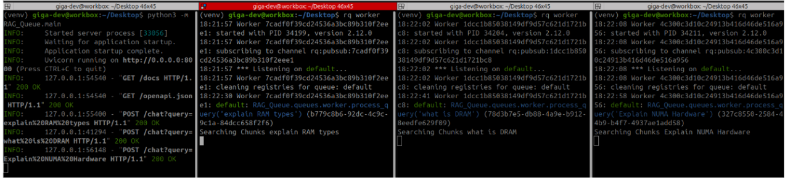
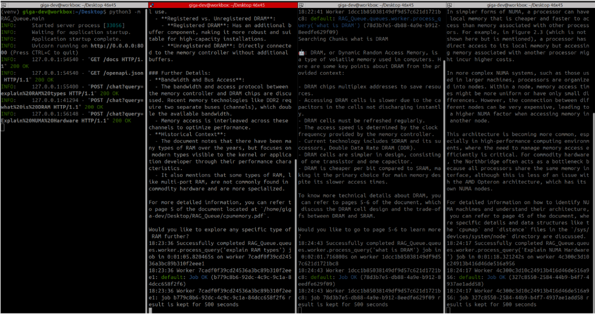
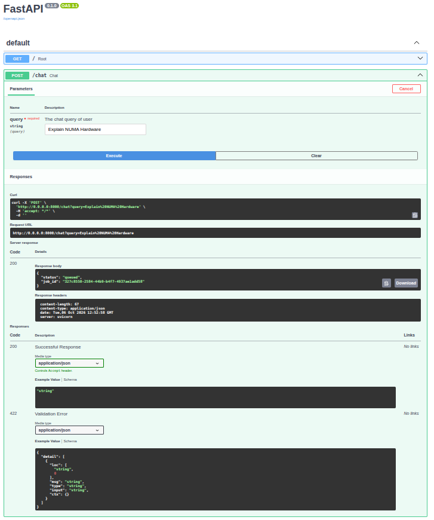
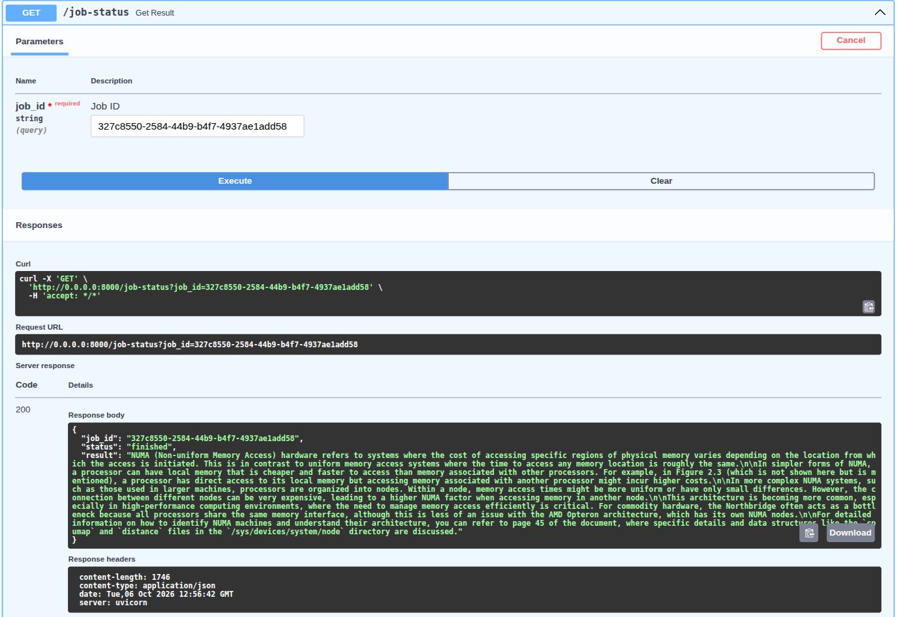

# Scalable Async RAG Pipeline with LangChain & Docker

A fully containerized, asynchronous Retrieval-Augmented Generation (RAG) backend engineered for scale. Built with FastAPI, LangChain, Qdrant vector database, Valkey/Redis task queue (RQ), and local LLM inference via Ollama.

---

## 📌 Architecture Overview

```text
User / Client
      │
      ▼  POST /chat?query=...
┌───────────────────┐
│   FastAPI Server  │  ──► Enqueues job to Valkey & returns job_id immediately
└───────────────────┘
          │
          ▼  Push Task
┌───────────────────┐
│  Redis / Valkey   │  (Dockerized Message Broker & Task Queue)
└───────────────────┘
          │
          ▼  Pulls Job
┌───────────────────┐
│     RQ Worker     │  (Background Task Consumer)
└───────────────────┘
     │            ▲
     │ LangChain  │ 1. Similarity Search (Top-K Chunks)
     ▼            │
┌───────────────────┐
│     Qdrant DB     │  (Dockerized Vector Store on :6333)
└───────────────────┘
     │
     │ 2. Grounded Context + User Query
     ▼
┌───────────────────┐
│   Ollama (LLM)    │  (Local Models: Qwen2.5:7b/ bge-m3)
└───────────────────┘
     │
     ▼  Saves Output & Lifecycle Status
Client polls GET /job-status?job_id=... ──► Receives final response


---

## ⚡ Concurrency in Action: Distributed Workers

The architecture decouples query reception from long LLM inference times. Multiple background workers listen on the queue and execute RAG pipelines simultaneously:





---


## ✨ Features

- **Dockerized Infrastructure**: Run Qdrant vector database and Redis / Valkey queue services locally in lightweight Docker containers.
- **LangChain Orchestration**: Modular PDF parsing (`PyPDFLoader`), semantic text chunking, embedding generation, and contextual prompt construction.
- **Asynchronous Processing**: Long-running LLM generation runs in background worker processes via Python RQ, keeping FastAPI endpoints non-blocking.
- **Private & Local Inference**: Powered by local Ollama instances (`qwen2.5:7b`, `bge-m3`) with zero external API fees and total privacy.
- **Swagger Documentation**: Interactive OpenAPI / Swagger UI provided out-of-the-box by FastAPI.


## 📁 Project Structure

```text
├── client/
│   └── rq_client.py         # Valkey connection and RQ queue initialization
├── queues/
│   └── worker.py            # Background worker task (similarity search + LLM invocation)
├── cpumemory.pdf            # Sample document knowledge base
├── docker-compose.yml       # Container services (Qdrant, Redis/Valkey)
├── index.py                 # Offline indexing script (PDF chunking + Qdrant upload)
├── main.py                  # Application entry point
├── server.py                # FastAPI routes (/chat, /job-status)
└── requirements.txt         # Project dependencies


## 🛠️ Tech Stack

- **Framework**: FastAPI, Uvicorn
- **Orchestration**: LangChain, `langchain-community`, `langchain-ollama`
- **Vector Database**: Qdrant (Docker)
- **Task Queue & Broker**: Python RQ, Redis / Valkey (Docker)
- **LLM Engine**: Ollama (`qwen2.5:7b` / `bge-m3`)
- **Containerization**: Docker Compose


## 🚀 Getting Started

### 1. Clone the Repository

```bash
git clone https://github.com/x-dheeraj/scalable_RAG.git
cd scalable_RAG

### 2. Start Services with Docker Compose

Launch the Qdrant vector database and Redis/Valkey queue containers:

```bash
docker compose up -d

Verify that the containers are up and running:

```bash
docker compose ps


### 3. Pull the Ollama Models

Ensure your local Ollama server is running, then pull the required models:

```bash
ollama pull qwen2.5:7b
ollama pull bge-m3


### 4. Create Virtual Environment & Install Dependencies

```bash
python3 -m venv venv
source venv/bin/activate
pip install -r requirements.txt

### 5. Ingest Documents into Qdrant

Run the indexing script to parse the PDF, generate embeddings, and load vector chunks into Qdrant:

```bash
python3 index.py


## ⚙️ Running the Application

Open two separate terminals in your project directory (with the virtual environment activated).

### Terminal 1: Start the Background Worker

```bash
rq worker --with-scheduler


### Terminal 2: Start the FastAPI API Server

```bash
python3 -m uvicorn server:app --reload --port 8000


## 📡 API Usage & Endpoints

Open your browser to `http://localhost:8000/docs` to test the API directly using the Swagger UI.

### 1. Enqueue a Chat Prompt

- **Endpoint:** `POST /chat`
- **Query Parameter:** `query=Explain NUMA Hardware`



- **Response:**

```json
{
  "status": "queued",
  "job_id": "327c8550-2584-44b9-b4f7-4937ae1add58"
}


### 2. Check Job Status & Retrieve Result

- **Endpoint:** `GET /job-status`
- **Query Parameter:** `job_id=327c8550-2584-44b9-b4f7-4937ae1add58`



- **Response (In Progress):**

```json
{
  "job_id": "327c8550-2584-44b9-b4f7-4937ae1add58",
  "status": "started",
  "result": null
}


- **Response (Completed):**

```json
{
  "job_id": "327c8550-2584-44b9-b4f7-4937ae1add58",
  "status": "finished",
  "result": "NUMA (Non-uniform Memory Access) hardware refers to systems where the cost of accessing specific regions of physical memory varies depending on the location from which the access is initiated..."
}
